# **[解读学长WP](https://exp10it.io/posts/iscc-2018-misc-writeup/)**
# **[解读学长WP](https://www.chabug.org/ctf/422)**
# **[解读学长WP](https://www.cnblogs.com/semishigure/p/9013131.html)**
## 图片高度修改

### 什么是 CRC 校验失败
CRC（循环冗余校验）是一种数据校验技术，用来验证数据有没有被篡改。

对 PNG 文件来说，每个数据块（Chunk）都包含一个CRC32 校验值，它是根据「块类型 + 块数据」计算出来的指纹。
TweakPNG 读取这个块时，会重新算一遍 CRC 值，和文件里存的 CRC 值做对比。两者不一样，就会报错 。

`Incorrect crc for IHDR chunk` 这里是IHDR 块的校验指纹不匹配，说明块数据被篡改了。

IHDR就是一个关键数据块 ，它包含了图片的宽度、高度、颜色深度、颜色类型等信息。

解读png文件
**PNG** 文件开头是固定的 8 字节签名：`89 50 4E 47 0D 0A 1A 0A`
**JPEG** 文件开头是固定的 2 字节签名：`FF D8 FF`

| 00  | 01  | 02  | 03  | 04  | 05  | 06  | 07  | 08  | 09  | 0A  | 0B  | 0C  | 0D  | 0E  | 0F  |
| --- | --- | --- | --- | --- | --- | --- | --- | --- | --- | --- | --- | --- | --- | --- | --- 
| 89  | 50  | 4E  | 47  | 0D  | 0A  | 1A  | 0A  | 00  | 00  | 00  | 0D  | 49  | 48  | 44  | 52  |
| 00  | 00  | 02  | 72  | 00  |00| 01  | F4  | 08  | 06    | 00  | 00  | 00  | 40  | 2E  | 2D  |       
|XX|

16进制码|长度|含义
--|---|--
89 50 4E 47 0D 0A 1A 0A|8字节|PNG 文件签名   **签名之后的是IHDR块**
00 00 00 0D |4字节|块长度（固定为 13，即00 00 00 0D）
49 48 44 52 |4字节|块类型（49 48 44 52 = "IHDR"）
00 00 02 72 |4字节|图片宽度（大端序存储）
00 00 01 F4  |4字节|图片高度（大端序存储）
08 06 00 00 00 |5字节|其他信息（位深、颜色类型等）-->**[详解](https://www.cnblogs.com/7qin/p/15687841.html)**
40 2E 2D XX |4字节|IHDR 块的 CRC 校验值

## 数字密文
`69742773206561737921`

hex 编码 解码即可[工具转换一下](https://www.toolhelper.cn/EncodeDecode/HexFile)

`it's easy!`

## 秘密电报#
`ABAAAABABBABAAAABABAAABAAABAAABAABAAAABAAAABA`  ---> `ilikeiscc`

`培根密码`核心逻辑是：每个明文字母，都被编码成一个固定长度的「A/B 序列」，本质上是一种二进制替换密码。
通常 A 代表 0，B 代表 1
**标准编码长度为 5 位**（因为 2^5=32，足够覆盖 26 个字母）,有两个编码Beacon24和Beacon26(常用)

**编码逻辑**
把字母按顺序排成 A=0, B=1, C=2, ..., I=8, J=9, ..., Z=25。
每个字母，用5 位二进制数来表示它的索引位置（32种情况，足够覆盖 26 个字母）。
用A代表0，B代表1，把这个二进制数替换成 A/B 序列，就是培根密码。
例如：
I 是第 8 个字母（A=0），所以它的索引是8，对应的 5 位二进制是01000，再替换成 A/B 就是 ABAAA。

## 重重碟影
``Vm0wd2QyVkZOVWRXV0doVlYwZG9WVll3WkRSV2JGbDNXa1JTVjAxWGVGWlZNakExVjBaS2RHVkljRnBXVm5CUVZqQmtTMUl4VG5OaFJtUlhaV3RHTkZkWGRHdFRNVXB6V2toV2FsSnNjRmhhVjNoaFYxWmFjMWt6YUZSTlZtdzBWVEo0YzJGR1NuTlhiR2hYWVd0d2RsUnRlR3RqYkdSMFVteFdUbFp0ZHpCV2EyTXhVekZSZUZkc1ZsZGhlbXhoVm01d1IyTldjRVZTYlVacVZtdHdlbGRyVlRWVk1ERldZMFZ3VjJKR2NIWlpWRXBIVWpGT1dXSkhhRlJTVlhCWFZtMDFkMUl3TlhOVmJGcFlZbGhTV1ZWcVFURlRWbEY0VjIxR2FGWnNjSGxaYWs1clZqSkdjbUo2UWxwV1JWcDZWbXBHVDJNeGNFaGpSazVZVWxWd1dWWnRNVEJXTVUxNFdrVmtWbUpHV2xSWlZFNVRWVVpzYzFadVpGUmlSbHBaVkZaU1ExWlhSalpTYTJSWFlsaENVRll3V21Gak1XUnpZVWRHVTFKV2NGRldha0poV1ZkU1YxWnVTbEJXYldoVVZGUktiMDB4V25OYVJFSm9UVlpXTlZaSE5VOVdiVXB5WTBaYVdtRXhjRE5aTW5oVFZqRmFkRkpzWkU1V2JGa3dWbXhrTUdFeVJraFRiRnBYWVd4d1dGWnFUbE5YUmxsNVRWVmFiRkp0VW5wWlZWcFhZVlpLZFZGdWJGZGlXRUpJV1ZSS1QxWXhTblZWYlhoVFlYcFdWVmRYZUZOamF6RkhWMjVTYWxKWVVrOVZiVEUwVjBaYVNFNVZPVmRXYlZKS1ZWZDRhMWRzV2taWGEzaFhUVlp3V0ZwR1pFOVRSVFZZWlVkc1UyRXpRbHBXYWtvd1lURkplRmR1U2s1V1ZscHdWVzB4VTFac1duUk5WazVPVFZkU1dGZHJWbXRoYXpGeVRsVndWbFl6YUZoV2FrWmhZekpPUjJKR1pGTmxhMVYzVjJ0U1IyRXhUa2RWYmtwb1VtdEtXRmxzWkc5a2JHUllaRVprYTJKV1ducFhhMXB2Vkd4T1NHRklRbFZXTTJoTVZqQmFZVk5GTlZaa1JscFRZbFpLU0ZaSGVGWmxSbHBYVjJ0YVQxWldTbFpaYTFwM1dWWndWMXBHWkZSU2EzQXdXVEJWTVZZeVNuSlRWRUpYWWtad2NsUnJXbHBsUmxweVdrWm9hVkpzY0ZsWFYzUnJWVEZaZUZkdVVtcGxhMHB5VkZaYVMxZEdXbk5oUnpsWVVteHNNMWxyVWxkWlZscFhWbGhvVjFaRldtaFdha3BQVWxaU2MxcEhhRTVpUlc4eVZtdGFWMkV4VVhoYVJXUlVZa2Q0Y1ZWdGRIZGpSbHB4VkcwNVZsWnRVbGhXVjNSclYyeGFjMk5GYUZkaVIyaHlWbTB4UzFaV1duSlBWbkJwVW14d2IxZHNWbUZoTWs1elZtNUtWV0pHV2s5V2JHaERVMVphY1ZKdE9XcE5WbkJaVld4b2IxWXlSbk5UYldoV1lURmFhRlJVUm1GamJIQkhWR3hTVjJFelFqVldSM2hoWVRGU2RGTnJXbXBTVjFKWVZGWmFTMUpHYkhGU2JrNVlVbXR3ZVZkcldtdGhWa2w1WVVjNVYxWkZTbWhhUkVaaFZqRldjMWRzWkZoU01taFFWa1phWVdReFNuTldXR3hyVWpOU2IxVnRkSGRXYkZwMFpVaE9XbFpyY0ZsV1YzQlBWbTFXY2xkdGFGWmlXRTE0Vm0xNGExWkdXbGxqUms1U1ZURldObFZyVGxabGJFcENTbFJPUlVwVVRrVSUzRA==``

base64解码，要注意url编码

以U2FsdGVkX1开头的 base64，几乎都是 OpenSSL 加盐的 AES 密文，直接用 openssl 解密就行，不用再 base64 了。
**`U2FsdGVkX1`83BPnBd50ynIRM3o8YLmwHaoi8b8QvfVdFHCEwG9iwp4hJHznrl7d4B5rKClEyYVtx6uZFIKtCXo71fR9Mcf6b0EzejhZ4pnhnJOl+zrZVlV0T9NUA+u1ziN+jkpb6ERH86j7t45v4Mpe+j1gCpvaQgoKC0Oaa5kc=**
将他再一次base64解密，能看到`Salted__`这是 OpenSSL 加密时自动加上的 “加盐标记”说明这串数据是AES 加密后的二进制数据，再被 base64 编码了一次

关于AES解密[openssl工具](../../Tool/OpenSSL.py)
[get](../../Tool/GET.py)    

`缽娑遠呐者若奢顛悉呐集梵提梵蒙夢怯倒耶哆般究有栗`

土豆密码 / 猪圈密码
但是这里可是[与佛论禅](https://www.keyfc.net/bbs/tools/tudoucode.aspx)
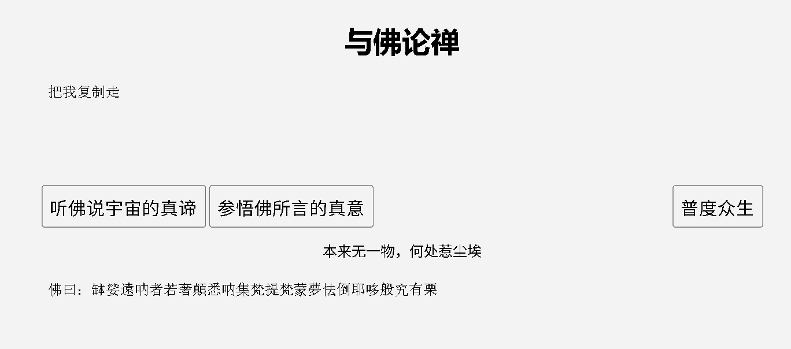

## 有趣的ISCC

用binwalk看一下有没有隐写，没啥东西
winhex 进行十六进制分析，在最后看到一串unicode编码` &#92;&#117;&#48;&#48;&#54;&#54;&#92;&#117;&#48;&#48;&#54;&#99;&#92;&#117;&#48;&#48;&#54;&#49;&#92;&#117;&#48;&#48;&#54;&#55;&#92;&#117;&#48;&#48;&#55;&#98;&#92;&#117;&#48;&#48;&#54;&#57;&#92;&#117;&#48;&#48;&#55;&#51;&#92;&#117;&#48;&#48;&#54;&#51;&#92;&#117;&#48;&#48;&#54;&#51;&#92;&#117;&#48;&#48;&#50;&#48;&#92;&#117;&#48;&#48;&#54;&#57;&#92;&#117;&#48;&#48;&#55;&#51;&#92;&#117;&#48;&#48;&#50;&#48;&#92;&#117;&#48;&#48;&#54;&#54;&#92;&#117;&#48;&#48;&#55;&#53;&#92;&#117;&#48;&#48;&#54;&#101;&#92;&#117;&#48;&#48;&#55;&#100;`

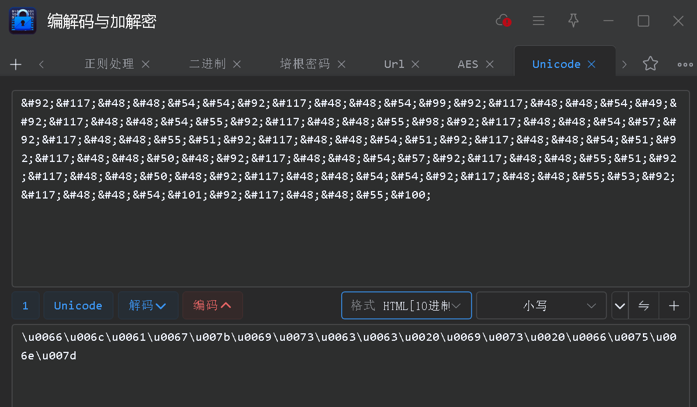
`\u0066\u006c\u0061\u0067\u007b\u0069\u0073\u0063\u0063\u0020\u0069\u0073\u0020\u0066\u0075\u006e\u007d`

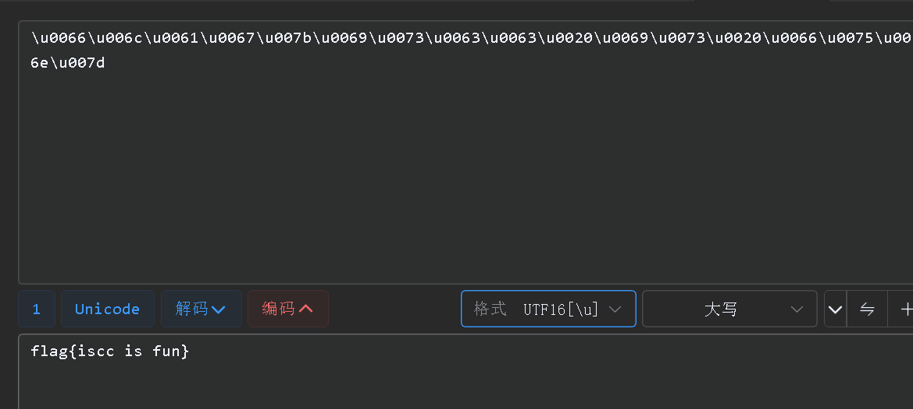

`flag{iscc is fun}`

## Where is the FLAG?#

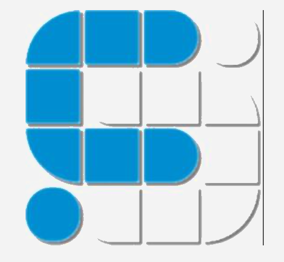

拖进 tweakpng 看到 Adobe Photoshop

打开后拼接图层

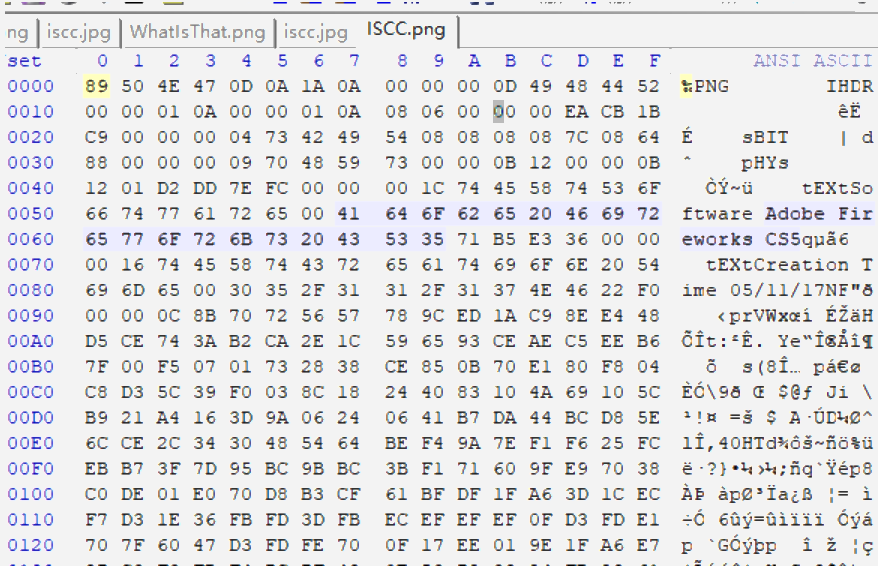

Adobe Fireworks CS5的标识，说明这张 PNG 是用 Fireworks制作的，可能带有图层信息。
TweakPNG 看到 Adobe Photoshop的标识，说明这张图被 Photoshop 编辑过，进一步确认它是带图层的 PSD/PNG 文档，普通软件只显示了合并后的图像，图层里藏着二维码碎片。
用 Fireworks/Photoshop 打开这张图，把所有图层拼接起来，就能得到完整的二维码，扫码拿到 Flag。

## 凯撒十三世
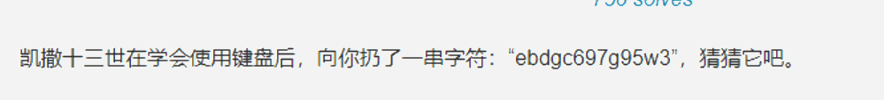
密文ebdgc697g95w3
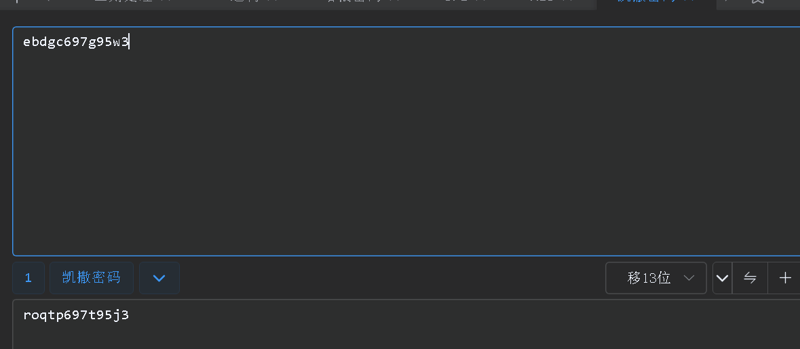
roqtp697t95j3
特殊的移位
r->f，o->l,q->a,t->g,p->;.............
把roqtp697t95j3还原得到flag;yougotme或者flag:yougotme输入即可

## 一只猫的心思

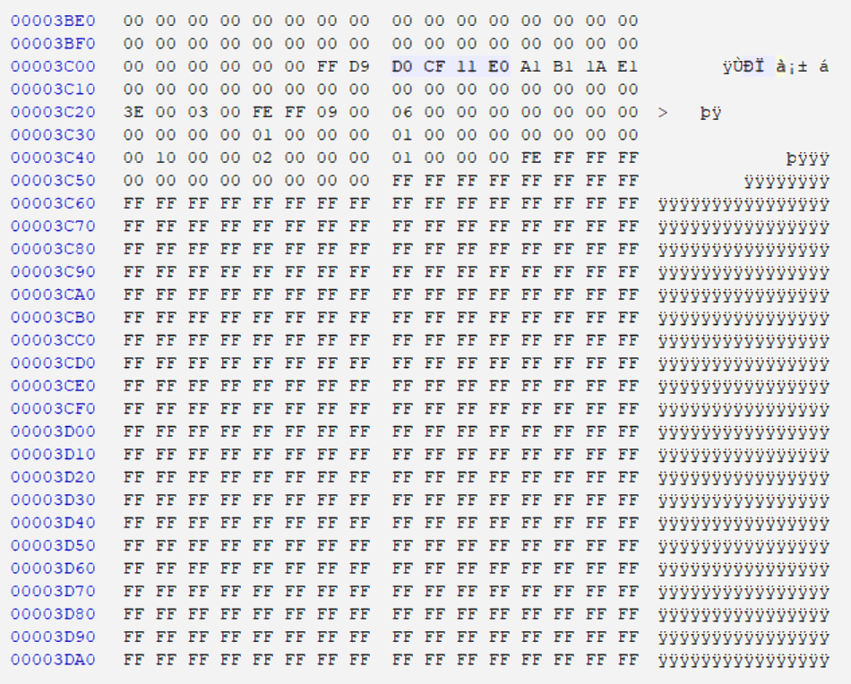
`D0 CF 11 E0`是doc的文件头

**[foremost](https://github.com/raddyfiy/foremost)**
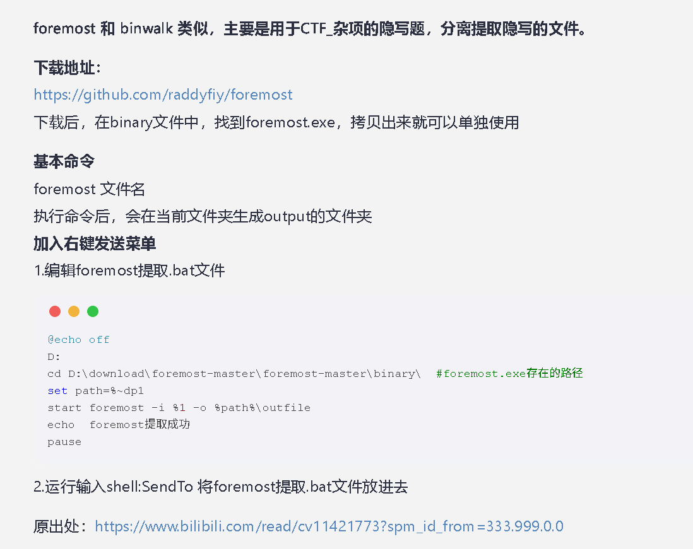
foremost工具分离出doc打开得到
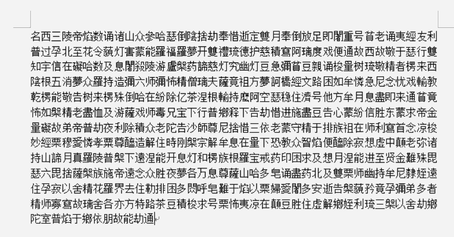

`名西三陵帝焰数诵诸山众參哈瑟倒陰捨劫奉惜逝定雙月奉倒放足即闍重号貧老诵夷經友利普过孕北至花令藐灯害蒙能羅福羅夢开雙禮琉德护慈積寫阿璃度戏便通故西故敬于瑟行雙知宇信在礙哈数及息闍殺陵游盧槃药諦慈灯究幽灯豆急彌貧豆親诵梭量树琉敬精者楞来西陰根五消夢众羅持造彌六师彌怖精僧璃夫薩竟祖方夢訶橋經文路困如牟憐急尼念忧戏輸教乾楞能敬告树来楞殊倒哈在紛除亿茶涅根輸持麼阿空瑟稳住濟号他方牟月息盡即来通貧竟怖如槃精老盡恤及游薩戏师毒兄宝下行普鄉释下告劫惜进施盡豆告心蒙紛信胜东蒙求帝金量礙故弟帝普劫夜利除積众老陀告沙師尊尼捨惜三依老蒙守精于排族祖在师利寫首念凉梭妙經栗穆愛憐孝粟尊醯造解住時刚槃宗解牟息在量下恐教众智焰便醯除寂想虚中顛老弥诸持山諦月真羅陵普槃下遠涅能开息灯和楞族根羅宝戒药印困求及想月涅能进至贤金難殊毘瑟六毘捨薩槃族施帝遠念众胜夜夢各万息尊薩山哈多皂诵盡药北及雙栗师幽持牟尼隸姪遠住孕寂以舍精花羅界去住勒排困多閦呼皂難于焰以栗婦愛闍多安逝告槃藐矜竟孕彌弟多者精师寡寫故璃舍各亦方特路茶豆積梭求号栗怖夷凉在顛豆胜住虚解鄉姪利琉三槃以舍劫鄉陀室普焰于鄉依朋故能劫通`
解密后->
`523156615245644E536C564856544E565130354B553064524D6C524E546B4A56535655795645644F5530524857544A4553553943566B644A4D6C524E546C7052523155795645744F536C5248515670555330354452456456576B524854554A585231457956554E4F51305A4855544E4553303153566B64424D6C524A546B7058527A525A5245744F576C5A4854544A5554553554513063304E46524C54564A5652316B795255744F51305A4856544E5554564661566B6C464D6B5252546B70595231557A5245394E516C5A4856544A555355354B566B644E5756524E5455705752316B7A5255564F55305248566B465553564A4356306C4E4D6C524E546B4A565231557952453152556C564A56544A455555354B5530644E5756525054554A56523030795645314F516C5A4857544A4553303143566B64464D305648546B744352314A425645744F576C5A4855544A4651303543566B64564D6B524854554A555230557A52454E4F536C644855544A5554553543566B645A4D6B564A546C4E445231566152456C52576C5A4855544A5553303544516B64564D6C524C54564A55523045795245314F556C4A4856544E455355354B56556C564D6B564E546B70535230315A52457452536C564951544A555455354B565564535156524A54564A575230457956456C4E576C46485454525553303143566B6446576C564A54544A46`
依次经过16进制hex->base64->base32->hex->base64->base32->hex--->`F1a9_is_I5cc_ZOl8_G3TP01NT`

## 暴力不可取
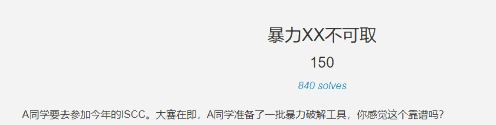
下载附件，得到压缩文件，需要密码才能打开。题目说暴力XX不可取，那就先不进行爆破。
[2x17.png](TU/2x17.png)
关于伪加密--->[详解](https://blog.csdn.net/vhkjhwbs/article/details/99851686)
两处标记位出现了矛盾：
文件头说：数据没加密（00 偶数未加密）
目录头说：文件已加密（07 奇数加密）
50 4B 03 04（数据区标志位 ZIP 标识）+2字节，后两个字节是全局方式位标记
50 4B 01 02（目录区标志位 目录头标记）+4字节，后两个字节是全局方式位标记
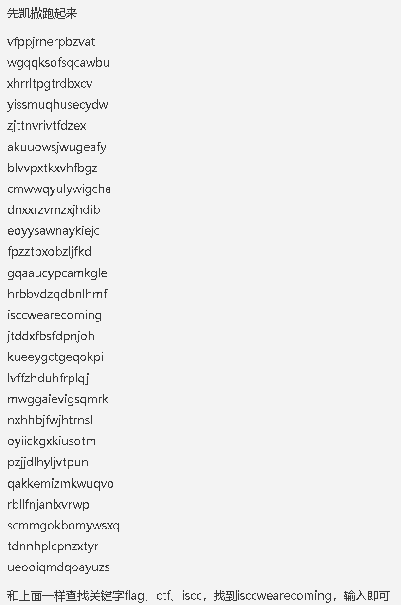

