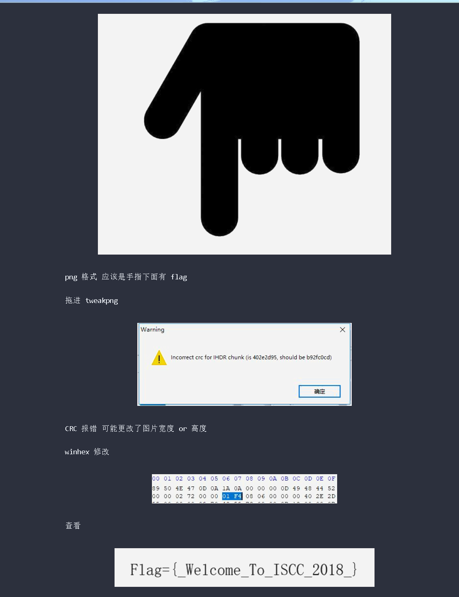
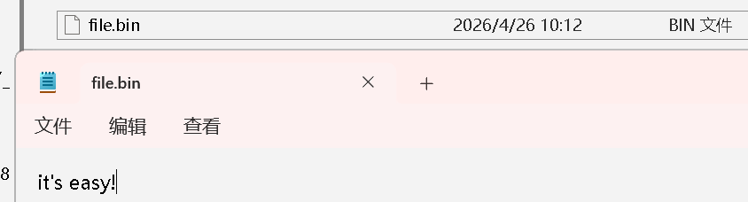
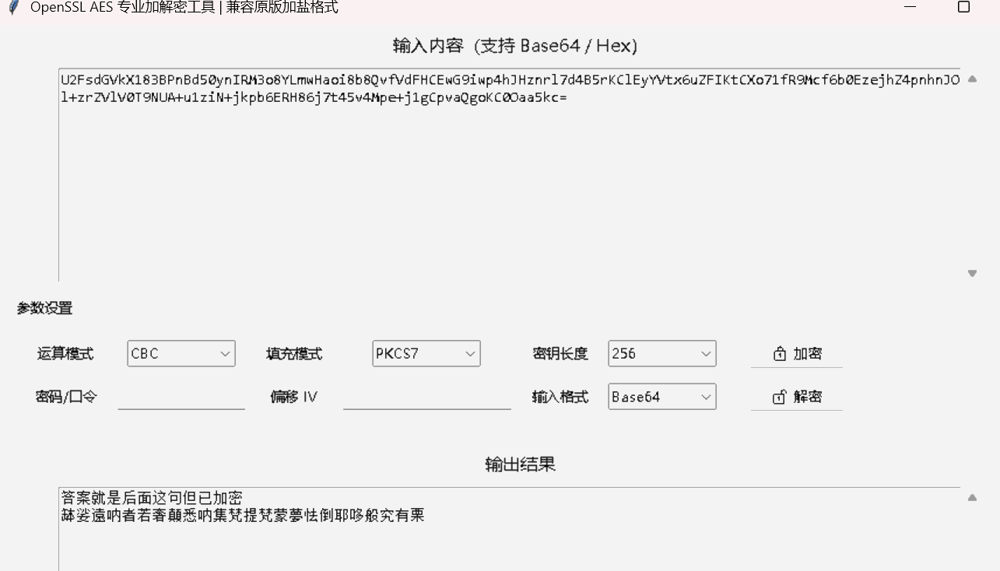

# **[解读学长WP](https://exp10it.io/posts/iscc-2018-misc-writeup/)**

## 图片高度修改

### 什么是 CRC 校验失败
CRC（循环冗余校验）是一种数据校验技术，用来验证数据有没有被篡改。

对 PNG 文件来说，每个数据块（Chunk）都包含一个CRC32 校验值，它是根据「块类型 + 块数据」计算出来的指纹。
TweakPNG 读取这个块时，会重新算一遍 CRC 值，和文件里存的 CRC 值做对比。两者不一样，就会报错 。

`Incorrect crc for IHDR chunk` 这里是IHDR 块的校验指纹不匹配，说明块数据被篡改了。

IHDR就是一个关键数据块 ，它包含了图片的宽度、高度、颜色深度、颜色类型等信息。

解读png文件
**PNG** 文件开头是固定的 8 字节签名：`89 50 4E 47 0D 0A 1A 0A`
**JPEG** 文件开头是固定的 2 字节签名：`FF D8 FF`

| 00  | 01  | 02  | 03  | 04  | 05  | 06  | 07  | 08  | 09  | 0A  | 0B  | 0C  | 0D  | 0E  | 0F  |
| --- | --- | --- | --- | --- | --- | --- | --- | --- | --- | --- | --- | --- | --- | --- | --- 
| 89  | 50  | 4E  | 47  | 0D  | 0A  | 1A  | 0A  | 00  | 00  | 00  | 0D  | 49  | 48  | 44  | 52  |
| 00  | 00  | 02  | 72  | 00  |00| 01  | F4  | 08  | 06    | 00  | 00  | 00  | 40  | 2E  | 2D  |       
|XX|

16进制码|长度|含义
--|---|--
89 50 4E 47 0D 0A 1A 0A|8字节|PNG 文件签名   **签名之后的是IHDR块**
00 00 00 0D |4字节|块长度（固定为 13，即00 00 00 0D）
49 48 44 52 |4字节|块类型（49 48 44 52 = "IHDR"）
00 00 02 72 |4字节|图片宽度（大端序存储）
00 00 01 F4  |4字节|图片高度（大端序存储）
08 06 00 00 00 |5字节|其他信息（位深、颜色类型等）-->**[详解](https://www.cnblogs.com/7qin/p/15687841.html)**
40 2E 2D XX |4字节|IHDR 块的 CRC 校验值

## 数字密文
`69742773206561737921`

hex 编码 解码即可[工具转换一下](https://www.toolhelper.cn/EncodeDecode/HexFile)

`it's easy!`

## 秘密电报#
`ABAAAABABBABAAAABABAAABAAABAAABAABAAAABAAAABA`  ---> `ilikeiscc`

`培根密码`核心逻辑是：每个明文字母，都被编码成一个固定长度的「A/B 序列」，本质上是一种二进制替换密码。
通常 A 代表 0，B 代表 1
**标准编码长度为 5 位**（因为 2^5=32，足够覆盖 26 个字母）,有两个编码Beacon24和Beacon26(常用)

**编码逻辑**
把字母按顺序排成 A=0, B=1, C=2, ..., I=8, J=9, ..., Z=25。
每个字母，用5 位二进制数来表示它的索引位置（32种情况，足够覆盖 26 个字母）。
用A代表0，B代表1，把这个二进制数替换成 A/B 序列，就是培根密码。
例如：
I 是第 8 个字母（A=0），所以它的索引是8，对应的 5 位二进制是01000，再替换成 A/B 就是 ABAAA。

## 重重碟影
``Vm0wd2QyVkZOVWRXV0doVlYwZG9WVll3WkRSV2JGbDNXa1JTVjAxWGVGWlZNakExVjBaS2RHVkljRnBXVm5CUVZqQmtTMUl4VG5OaFJtUlhaV3RHTkZkWGRHdFRNVXB6V2toV2FsSnNjRmhhVjNoaFYxWmFjMWt6YUZSTlZtdzBWVEo0YzJGR1NuTlhiR2hYWVd0d2RsUnRlR3RqYkdSMFVteFdUbFp0ZHpCV2EyTXhVekZSZUZkc1ZsZGhlbXhoVm01d1IyTldjRVZTYlVacVZtdHdlbGRyVlRWVk1ERldZMFZ3VjJKR2NIWlpWRXBIVWpGT1dXSkhhRlJTVlhCWFZtMDFkMUl3TlhOVmJGcFlZbGhTV1ZWcVFURlRWbEY0VjIxR2FGWnNjSGxaYWs1clZqSkdjbUo2UWxwV1JWcDZWbXBHVDJNeGNFaGpSazVZVWxWd1dWWnRNVEJXTVUxNFdrVmtWbUpHV2xSWlZFNVRWVVpzYzFadVpGUmlSbHBaVkZaU1ExWlhSalpTYTJSWFlsaENVRll3V21Gak1XUnpZVWRHVTFKV2NGRldha0poV1ZkU1YxWnVTbEJXYldoVVZGUktiMDB4V25OYVJFSm9UVlpXTlZaSE5VOVdiVXB5WTBaYVdtRXhjRE5aTW5oVFZqRmFkRkpzWkU1V2JGa3dWbXhrTUdFeVJraFRiRnBYWVd4d1dGWnFUbE5YUmxsNVRWVmFiRkp0VW5wWlZWcFhZVlpLZFZGdWJGZGlXRUpJV1ZSS1QxWXhTblZWYlhoVFlYcFdWVmRYZUZOamF6RkhWMjVTYWxKWVVrOVZiVEUwVjBaYVNFNVZPVmRXYlZKS1ZWZDRhMWRzV2taWGEzaFhUVlp3V0ZwR1pFOVRSVFZZWlVkc1UyRXpRbHBXYWtvd1lURkplRmR1U2s1V1ZscHdWVzB4VTFac1duUk5WazVPVFZkU1dGZHJWbXRoYXpGeVRsVndWbFl6YUZoV2FrWmhZekpPUjJKR1pGTmxhMVYzVjJ0U1IyRXhUa2RWYmtwb1VtdEtXRmxzWkc5a2JHUllaRVprYTJKV1ducFhhMXB2Vkd4T1NHRklRbFZXTTJoTVZqQmFZVk5GTlZaa1JscFRZbFpLU0ZaSGVGWmxSbHBYVjJ0YVQxWldTbFpaYTFwM1dWWndWMXBHWkZSU2EzQXdXVEJWTVZZeVNuSlRWRUpYWWtad2NsUnJXbHBsUmxweVdrWm9hVkpzY0ZsWFYzUnJWVEZaZUZkdVVtcGxhMHB5VkZaYVMxZEdXbk5oUnpsWVVteHNNMWxyVWxkWlZscFhWbGhvVjFaRldtaFdha3BQVWxaU2MxcEhhRTVpUlc4eVZtdGFWMkV4VVhoYVJXUlVZa2Q0Y1ZWdGRIZGpSbHB4VkcwNVZsWnRVbGhXVjNSclYyeGFjMk5GYUZkaVIyaHlWbTB4UzFaV1duSlBWbkJwVW14d2IxZHNWbUZoTWs1elZtNUtWV0pHV2s5V2JHaERVMVphY1ZKdE9XcE5WbkJaVld4b2IxWXlSbk5UYldoV1lURmFhRlJVUm1GamJIQkhWR3hTVjJFelFqVldSM2hoWVRGU2RGTnJXbXBTVjFKWVZGWmFTMUpHYkhGU2JrNVlVbXR3ZVZkcldtdGhWa2w1WVVjNVYxWkZTbWhhUkVaaFZqRldjMWRzWkZoU01taFFWa1phWVdReFNuTldXR3hyVWpOU2IxVnRkSGRXYkZwMFpVaE9XbFpyY0ZsV1YzQlBWbTFXY2xkdGFGWmlXRTE0Vm0xNGExWkdXbGxqUms1U1ZURldObFZyVGxabGJFcENTbFJPUlVwVVRrVSUzRA==``

以U2FsdGVkX1开头的 base64，几乎都是 OpenSSL 加盐的 AES 密文，直接用 openssl 解密就行，不用再 base64 了。
**`U2FsdGVkX1`83BPnBd50ynIRM3o8YLmwHaoi8b8QvfVdFHCEwG9iwp4hJHznrl7d4B5rKClEyYVtx6uZFIKtCXo71fR9Mcf6b0EzejhZ4pnhnJOl+zrZVlV0T9NUA+u1ziN+jkpb6ERH86j7t45v4Mpe+j1gCpvaQgoKC0Oaa5kc=**
将他再一次base64解密，能看到`Salted__`这是 OpenSSL 加密时自动加上的 “加盐标记”说明这串数据是AES 加密后的二进制数据，再被 base64 编码了一次

关于AES解密[openssl工具](CTF/Tool/OpenSSL.py)
[get](CTF/Tool/GET.py)

