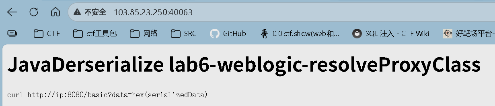

# Java反序列化漏洞
JavaDerserialize lab6-weblogic-resolveProxyClass

Java反序列化  -    lab6   -  网络应用服务器    -        解析代理类

## curl http://ip:8080/basic?data=hex(serializedData)   

表明目标是一个Web服务端点（basic接口），通过data参数接收十六进制编码的序列化数据（hex(serializedData)）。服务端逻辑大概率会对该参数进行反序列化操作，因此攻击者可构造恶意序列化对象（如利用CommonsCollections、JDK内置类的Gadget链），实现远程代码执行（RCE）等攻击效果。

