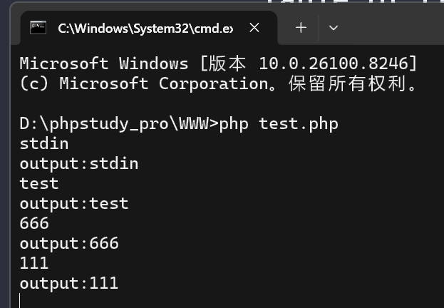
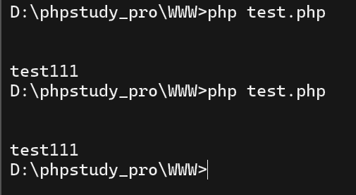
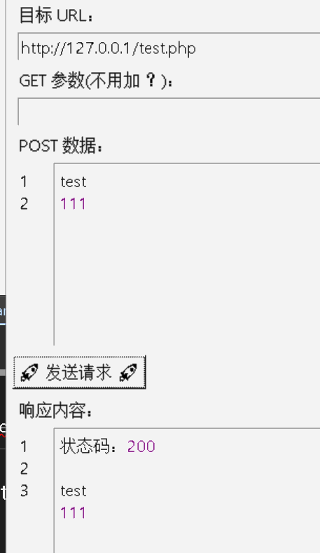
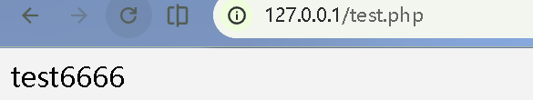
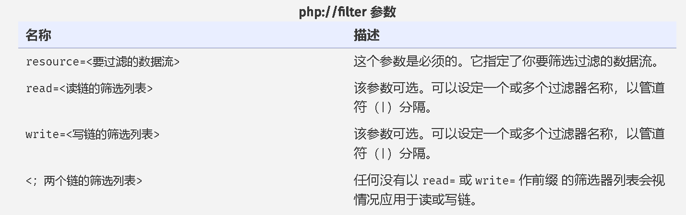
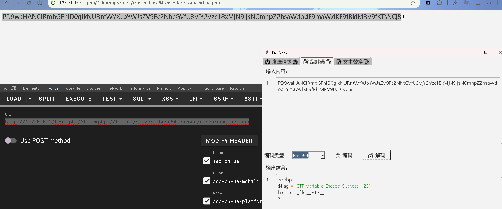

# 常见的PHP伪协议

> [PHP伪协议详情](https://www.php.net/manual/zh/wrappers.php.php)

`file://` `http://` `ftp://` `php://` `zlib://` `data://` `glob://` `phar://` `ssh2://` `rar://` `ogg://` `expect://`


`php://stdin` `php://stdout` `php://sterr ``php://input` `php://output` `php://filter`

## `php://stdin` 用于从标准输入读取数据。
```
<?php
$f = fopen('php://stdin','r');
while(!feof($f)){
	echo 'output:'.fgets($f);
}
?>

```
`fopen` — 打开文件或者 URL   指定的命名资源绑定到流     >[PHP fopen 详情](https://www.php.net/manual/zh/function.fopen.php)
`feof` — 检查是否到达文件结束      >[PHP feof 详情](https://www.php.net/manual/zh/function.feof.php)
`fgets` — 从文件指针读取一行       >[PHP fgets 详情](https://www.php.net/manual/zh/function.fgets.php)



## `php://stdout` 用于将标准输出写入数据。
输出 类似于 echo
```
<?php
$f = fopen('php://stdout','w');
fwrite($f,'test111');
fclose($f);
?>
```
`fwrite($stream,$data, int $length = 0)`  — 向文件指针写入数据       >[PHP fwrite 详情](https://www.php.net/manual/zh/function.fwrite.php)
`fclose($stream)`  — 关闭文件指针       >[PHP fclose 详情](https://www.php.net/manual/zh/function.fclose.php)



## `php://sterr` 用于将标准错误写入数据。
和 php://stdout 一样
## `php://input` 用于从标准输入读取数据。
读取 POST 数据 作为 php 代码执行
```
<?php
echo file_get_contents('php://input');
?>
```



## `php://output` 用于将数据写入标准输出。

```
<?php
$f = fopen('php://output','w');
fwrite($f,'test6666');
fclose($f)
?>
```



## `php://filter` 用于将数据通过过滤器进行处理。
php 元封装器 类似于 readfile() file() file_get_contents()
读取文件内容



常用过滤器
过滤器名|描述
---|---
`convert.base64-encode` |— 编码为 Base64 格式
`convert.base64-decode` |— 解码 Base64 格式
`convert.hex-encode` |— 编码为十六进制
`convert.hex-decode` |— 解码十六进制
`convert.qprint-encode` |— 编码为 QPrint 格式
`convert.qprint-decode` |— 解码 QPrint 格式
`string.rot13` |— 编码为 ROT13 格式
`string.toupper` |— 转换为大写母
`string.tolower` |— 转换为小写母
`string.strip_tags` |— 移除 HTML 标签
`convert.quoted-printable-encode` |— 编码为 Quoted-printable 格式
`convert.quoted-printable-decode` |— 解码 Quoted-printable 格式


例
```
<?php
highlight_file(__FILE__);
$filter = ['flag', 'php', 'filter', 'input', 'data', '..', '/', '\\'];
foreach ($filter as $word) {
    if (strpos(strtolower($_GET['1']), $word) !== false) {
        die("非法关键词！");
    }
}
if (isset($_GET['1'])) {
    include($_GET['1']);
} else {
    echo "请传入参数 ?1=...";
}
?>
```
**使用strpos 匹配完整字符串，但 PHP 协议名、文件名是大小写不敏感的！**
pyload=url/?1=PHP://Filter/Readconvert.base64-encode/resource=FlAg.Php

?c=include($_GET[1]);&1=php://filter/convert.base64-encode/resource=flag.php

```
<?php
echo file_get_contents($_GET['file']);
?>
```
pyload=http://127.0.0.1/test.php/?file=php://filter/convert.base64-encode/resource=flag.php



