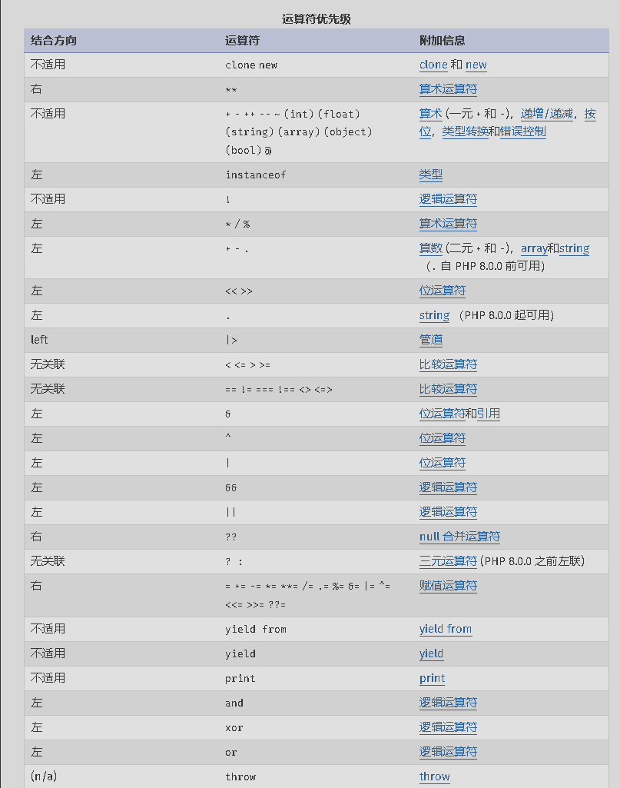

# PHP基础
>https://www.php.net/manual/zh/index.php
## PHP 基础格式
1. PHP 标签
```
<?php
    //执行的相关PHP代码
?>
```
2. 从 HTML 中分离
    PHP 解析器会忽略一对开始和结束标签之外的内容，这使得 PHP 文件可以具备混合内容。可以使 PHP 嵌入到 HTML 文档中去，例如创建模板
```
<p>This is going to be ignored by PHP and displayed by the browser.</p>
<?php echo 'While this is going to be parsed.'; ?>
<p>This will also be ignored by PHP and displayed by the browser.</p>
```


## 变量 赋值 以及 运算符
1. 变量
   PHP 中的变量用一个美元符号后面跟变量名来表示。变量名是区分大小写的。
   有效的变量名由字母（A-Z、a-z 或 128 到 255 之间的字节）或者下划线开头，后面跟上任意数量的字母，数字，或者下划线。
   **变量名不能以数字开头。**
   访问模糊的变量名
   ```
   <?php
    ${'invalid-name'} = 'bar';
    $name = 'invalid-name';
    echo ${'invalid-name'}, " ", $$name;
    ?>

    ---> bar bar
   ```
   
2. 赋值
   PHP 是一门弱类型语言，我们不必向 PHP 声明该变量的数据类型。
   变量默认始终传值赋值。那也就是说，当表达式的值赋值给变量时，整个原始表达式的值被赋值到目标变量。这意味着，当一个变量的值赋予另外一个变量时，改变其中一个变量的值，将不会影响到另外一个变量。

    PHP 也提供了另外一种方式给变量赋值：引用赋值。
    使用引用赋值，简单地将一个 & 符号加到将要赋值的变量前（源变量）。
    **只有变量才可以引用赋值。**
    ```
    <?php
    $foo = 'Bob';              // 将 'Bob' 赋给 $foo
    $bar = &$foo;              // 通过 $bar 引用 $foo
    $bar = "My name is $bar";  // 修改 $bar 变量
    echo $bar;
    echo $foo;                 // $foo 的值也被修改
    ?>
    ---> My name is Bob My name is Bob
    ```


3. 运算符
   

   运算符|等同于|描述
   -----|-----|-----
    x = y	|x = y	|左操作数被设置为右侧表达式的值
    x ?= y	|x = x ? y	|支持 +=, -=, *=, /=, %=,.=

    逻辑运算符
    >详情：https://www.php.net/manual/zh/language.operators.logical.php

    运算符	|名称	|描述
    -----|-----|-----
    x and / && y |与|如果 x 和 y 都为 true，则返回 true
    x or /双中线|  或	| 如果 x 和 y 至少有一个为 true，则返回 true
    x xor y	|异或	|如果 x 和 y 有且仅有一个为 true，则返回 true
    ! x	|非	|如果 x 不为 true，则返回 true

    类型比较
    >详情：https://www.php.net/manual/zh/language.operators.comparison.php

    **松散比较：使用两个等号 == 比较，只比较值，不比较类型**。
    **严格比较：用三个等号 === 比较，除了比较值，也比较类型。**
    ```
    0 == false: bool(true)
    0 === false: bool(false)
    ```

    输出
    **echo - 可以输出一个或多个字符串
    print - 只允许输出一个字符串，返回值总为 1**
    
    运算符的优先级
   >运算符优先级：https://www.php.net/manual/zh/language.operators.precedence.php
    **下表按照优先级从高到低**
   
## 数组
   >数组：https://www.php.net/manual/zh/language.operators.array.php

   array() 函数用于创建数组
   ```
   <?php
    $cars=array("Hello","CTF");
    echo "I like " . $cars[0] . " " . $cars[1] . ".";
    ?>
   ```
   pyload(GET POST)中传入数组：**数组名[]="数组元素"**

   数组是一种特殊的数据类型，用于存储多个值。
   数组可以是关联数组，也可以是索引数组。
   关联数组：每个元素都有一个键名，键名可以是字符串或整数。
   索引数组：每个元素都有一个键名，键名是整数，从 0 开始递增。
## 魔术常量
   >详情：https://www.php.net/manual/zh/language.constants.magic.php
    **__FILE__** 这样的 **__XXX__** 预定义常量，被称为魔术常量
   所有这些“魔术”常量都在编译时解析，而常规常量则在运行时解析

    魔术常量名|描述
    -----|-----
   __LINE__	|文件中的当前行号。
    __FILE__	|文件的完整路径和文件名。如果用在被包含文件中，则返回被包含的文件名。
    __DIR__	|文件所在的目录。如果用在被包括文件中，则返回被包括的文件所在的目录。它等价于 dirname(__FILE__)。除非是根目录，否则目录中名不包括末尾的斜杠。
    __FUNCTION__	|当前函数的名称。匿名函数则为 {closure}。
    __CLASS__	|当前类的名称。类名包括其被声明的作用域（例如 Foo\Bar）。当用在 trait 方法中时，__CLASS__ 是调用 trait 方法的类的名字。
    __TRAIT__	|Trait 的名字。Trait 名包括其被声明的作用域（例如 Foo\Bar）。
    __METHOD__	|类的方法名。
    __PROPERTY__	|仅在属性挂钩内有效。等同于属性的名称。
    __NAMESPACE__	|当前命名空间的名称。
    ClassName::class	|完整的类名。
## 表单数据

    **$_GET** —— 接受 GET 请求传递的参数。

    示例：`example.com/index.php?book=HELLOCTF`，你可以使用 $_GET['book'] 来获取相应的值。

    **$_POST** —— 接受 POST 请求传递的参数。

    示例：对 `example.com/index.php` 进行 POST 传参，参数名为 book 内容为 HelloCTF，你可以使用 $_POST['book'] 来获取相应的值。

    **$_REQUEST** —— 接受 GET 和 POST 以及 Cookie 请求传递的参数。
## 函数
   >详情：https://www.php.net/manual/zh/funcref.php
文件操作函数：

函数名|描述
-----|-----
include()|导入并执行指定的 PHP 文件。例如：include('config.php'); 会导入并执行 config.php 文件中的代码。
require()|类似 include()，但如果文件不存在，则会产生致命错误。
include_once(), require_once()|分别与 include 和 require 类似，但只导入文件一次。
fopen()|打开一个文件或 URL。例如：$file = fopen("test.txt", "r"); 会以只读模式打开 test.txt。
file_get_contents()|读取文件的全部内容到一个字符串。例如：$content = file_get_contents("test.txt");
file_put_contents()|将一个字符串写入文件。例如：file_put_contents("test.txt", "Hello World!");


代码执行函数：
函数名|描述
-----|-----
eval()|执行字符串中的 PHP 代码。例如：eval('$x = 5;'); 会设置变量 $x 的值为 5。
assert()|用于调试，检查一个条件是否为 true。
system(), shell_exec(), exec(), passthru()|执行外部程序或系统命令。例如：system("ls"); 会执行 ls 命令并显示输出。
    
反序列化函数：

unserialize(): 将一个已序列化的字符串转换回 PHP 的值。
例如：`$array = unserialize($serializedStr); `可以将一个序列化的数组字符串转换为数组。

数据库操作函数：

`mysql_query(), mysqli_query()`: 发送一个 MySQL 查询。例如：$result = mysql_query("SELECT * FROM users");
    
其他函数：

`preg_replace()`: 执行正则表达式搜索和替换。例如：$newStr = preg_replace("/apple/i", "orange", $str); 会将 $str 中的 "apple" 替换为 "orange"。

`create_function()`: 创建匿名的 lambda 函数。例如：`$func = create_function('$x', 'return $x + 1;');`


## 绕过


