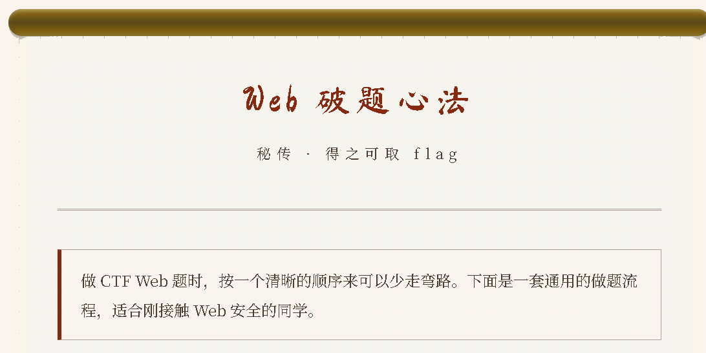

**basic**

跟着心法走ctrl+U看源码

**basic2**

F12和ctrl+U都被禁了
但是ctrl+shift+j可以打开控制台
也可以禁用JS，关闭反调试再查看源码

看到的flag需要base64解码
**basic_2**

检查一圈没什么可用的。BP抓包
有一个`is_admin=0`。改为`is_admin=1`在重新发包，发现flag在响应体中

**basic_3**

检查源码，有js文件。

复制引号里面的东西，在控制台里执行，发现flag在响应体中。    

这就是密码，还要给他    

**basic_4**


查看源码有js文件

ASCLL码解密
| 变量 | 字符码 | 解码结果 |
|------|--------|----------|
| `_0` | 81,67,67,84,70,95,86,73,80,95,50,48,50,54 | **`QCCTF_VIP_2026`** |
| `_1` | 47,102,108,97,103 | **`/flag`** |
| `_2` | 86,73,80,95,78,79,84,95,72,69,82,69 | **`VIP_NOT_HERE`** |

**basic_5**

直接抓包。领取奖励，请求中有base64编码的data。解码是`{"score":0}`
将他修改为`{"score":1000}`然后base64编码再发包。

响应中的data再base64解码

**basic_6**

检查源码没什么有用的东西
抓包在标头有发现flag


**basic_7**

拼图之后提交会返回你是小猪。flag就在这个返回的响应体中。
这是拼图之后发送的包，flag是不存在的

这个包**放行**之后还会有一个包，flag在响应体中。


**basic_8**

查看源码，抓包，都没什么有用信息
查看index.phps。至于为什么时phps下一题有解释

有发现。给了一个GET a  越过if条件就可以获得flag


**basic_9**

没有index.php所以试不了
文章中有提到爬虫排除协议
访问/robots.txt

有一个qcq.php
打开文件就是flag
**basic_10**


好吧都没有用


目录扫描，找到一个sitemap.xml ，打开发现一个wqw.php
wqw.php需要Cookie是admin身份


**EZ_PHP**

GET a和b
 PHP 中 `and` 的优先级比 `==` 低
a构造为0e就可以绕过
b在数字后面加一个字母即可
PHP 的弱类型特性：字符串和数字比较时，会自动从开头提取数字部分，非数字部分会被忽略。

**EZ_PHP1**


必须传入非空的qc参数
qc必须是合法 JSON，解码后转成数组
array_search("QCCTF", $qc)的结果必须严格等于1

array_search("QCCTF", $qc) 会在数组中搜索值为"QCCTF"的元素，并返回它的键名

`?qc=["1","QCCTF"]`


**ezphp_2**

```
$qc是一个包含"n"键的数组，"n"对应的值是一个非空数组
$qc中存在值为0的元素（绕过QCCTF的array_search）
$qc["n"]数组中存在值为0的元素（绕过QCyyds的array_search）
$qc["n"]数组中没有严格等于"QCyyds"的元素
```


**第一章**


禁用js就可以粘贴了

500次就交给BP吧。第500次有flag
额，可能题目没做好吧
**第二章**


藏字了。`前往/golden_trail看看`


题目提示http的请求头

moectf{0bs3rv3_Th3_Gold3n_traiL}
改成flag{}就行

**第三章**


**第四章**


--->`bW9lY3Rme0Mw`


--->`bjZyNDd1MTQ3`


--->`MTBuNV95MHVy`


--->`X2g3N1BfbDN2`


--->`M2xfMTVfcjM0`


--->`bGx5X2gxOWgh`


把GET改为PUT。在最下面写上`新生！`

--->`fQ==`  

`bW9lY3Rme0MwbjZyNDd1MTQ3MTBuNV95MHVyX2g3N1BfbDN2M2xfMTVfcjM0bGx5X2gxOWghfQ==`
base64-->`moectf{C0n6r47u14710n5_y0ur_h77P_l3v3l_15_r34lly_h19h!}`
要改成**flag{C0n6r47u14710n5_y0ur_h77P_l3v3l_15_r34lly_h19h!}**


**第五章**


