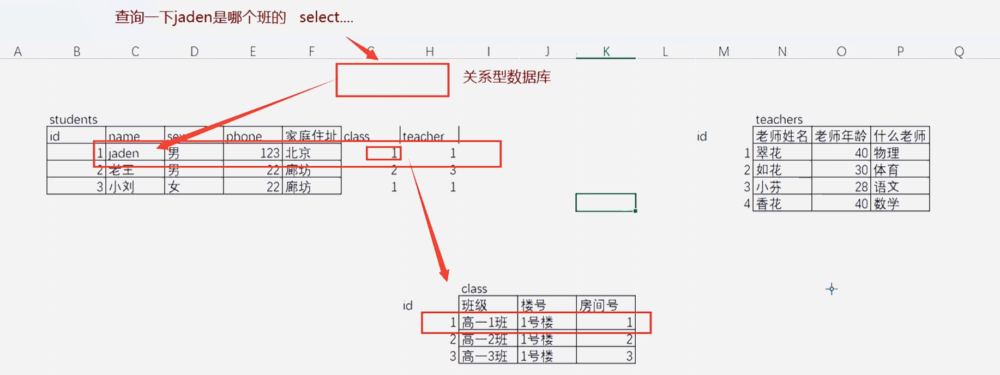

# 数据库
数据库是专门存储数据的地方，配合数据库管理系统（DBMS）进行数据管理。

网站运行在服务器上，数据存储于服务器硬盘的文件中，传统文件操作工具（如记事本、Word、Excel）无法高效处理大量并发访问。

传统的文件管理工具的局限性
- 工具如 Notepad++、Word、记事本等仅适合本地小规模文件操作。
- 当用户量大时（如上万用户），打开整个文件读取特定数据效率极低，甚至导致程序崩溃。
- 无法精准提取指定数据（如仅获取用户名或某条记录），必须手动筛选。

数据库管理系统的核心功能 

- 将文件数据通过内部机制重新加工和存储。
- 提供指令接口，允许外部程序发送请求以精确获取所需数据。
- 支持高效的数据存取，可快速返回特定记录（如 ID=2 的用户信息）。
- 可按列提取数据（如只提取 name 列），无需加载全部内容。
- 数据库管理系统支持多用户与多客户端访问 

数据库管理系统支持多用户与多客户端访问 

- 支持多个用户同时访问并获取各自数据，响应速度快。
- 支持多个不同网站（客户端）连接同一数据库服务端共享数据。

**SQL 全称为 Structured Query Language，简称 SQL 语句，用于向数据库发送查询、插入、更新、删除等操作指令。**

# 数据库分类
两大类：关系型数据库（RDBMS）和非关系型数据库（NoSQL）。
## 关系型数据库
通过ID将多个数据表连接起来，形成一个完整的数据库。
注重关系维护

常见关系型数据库管理系统
例如MySQL、PostgreSQL、SQLite Access SQL Server  Oracle MariaDB等。
Oracle:甲骨文公司开发的关系型数据库管理系统，是全球最大的数据库软件公司。
MySQL:社区开发的关系型数据库管理系统，是免费的开源的，功能强大，使用简单。被甲骨文收购，出现收费版本和社区免费版本。
PostgreSQL:由AT&T实验室开发的关系型数据库管理系统，功能强大，支持事务、并发控制、数据加密等高级功能。
SQLite:小型嵌入式数据库管理系统，无需单独安装，直接在应用程序中嵌入。
MariaDB:基于MySQL的开源数据库管理系统，功能强大，支持事务、并发控制、数据加密等高级功能。
Access:微软公司开发的关系型数据库管理系统，功能简单，安全性低，适用于小型项目。

## 非关系型数据库
注重效率
数据之间本就没有关系，不使用ID将数据表连接起来，每个数据表都是独立的。

例如 MongoDB、Redis、Cassandra等。
MongoDB:是一个开源的、高性能的、具有分布式内存对象的缓存系统。数据存储在内存中，通过它可以减轻数据库负载，加速动态的weeb应用。支持分布式部署。
Redis:和Memcached类似。但redis支持的存储value类型相对更多，包括string(字符串)、list(链表)、set(集合)和zset(有序集合)。  

MongoDB：是一个介于关系型数据库和非关系型数据库之间的产品，是非关系型数据库当中功能最丰富，最像关系数据库的。
Cassandra:分布式数据库管理系统，适用于高并发、高可用场景。

