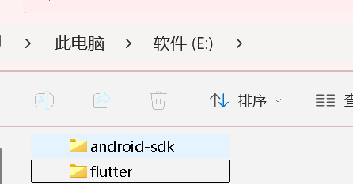
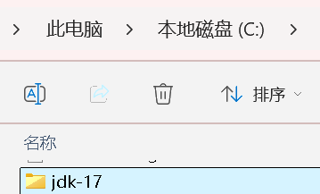
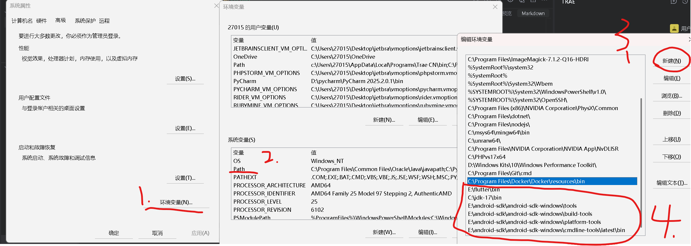
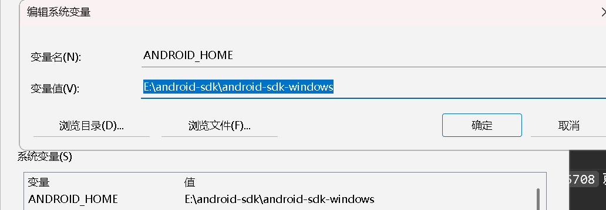
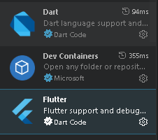

Flutter
## 环境配置
1.[JDK17下载](https://www.oracle.com/java/technologies/javase/jdk17-archive-downloads.html)

   [android-SDK下载](https://www.androiddevtools.cn/)
[android-sdk下载的详解](https://blog.csdn.net/m0_54685755/article/details/145336054)

3.[command-tools下载](https://developer.android.com/studio#command-tools)
4.[Flutter下载](https://docs.flutter.cn/install/manual)
下载后解压到除C盘以外的目录不要有中文路径(自己能找到就行)


command-tools 下载 解压 之后改名为latest。
在android-SDK目录下创建一个文件夹，命名为cmdline-tools。
将latest文件夹剪切到cmdline-tools    文件夹下。
**[夸克打包](https://pan.quark.cn/s/bccec4a0e45d?pwd=kmAy)**
### 配置环境变量


1. 配置JDK17环境变量
2. 配置android-SDK环境变量
3. 配置Flutter环境变量
4. 在你的IDE中安装Flutter插件(我用的是vscode)
     Flutter插件+Dart插件
ok到此环境算是配好了,可以尽情去敲码了

先创建一个空文件夹吧（名字不要大写，问就是踩过坑）
右键 打开终端
进行环境检查
```
java --version 
flutter --version 
flutter doctor --android-licenses -->一直Y就行直到   All SDK package licenses accepted.
sdkmanager --version
flutter config --list 
最后一行有 android-sdk: E:\android-sdk\android-sdk-windows 就可以了。没有就flutter config --android-sdk E:\android-sdk\android-sdk-windows（注意路径）
flutter doctor  全绿就行最后一个 Network resources黄了没事主要原因国内上不了谷歌，没关系
```
目前项目文件夹是空的.终端运行
`flutter create .`等待它执行完毕，会自动生成：
android/（安卓工程）
lib/（代码文件夹）
所有配置文件


## 下面是完整的国内镜像全套配置
1️⃣ android/settings.gradle.kts
kotlin
```
pluginManagement {
    repositories {
        maven { url 'https://mirrors.huaweicloud.com/repository/gradle-plugin' }
        maven { url 'https://mirrors.aliyun.com/gradle/plugin' }
        maven { url 'https://mirrors.huaweicloud.com/repository/maven' }
        google()
        mavenCentral()
        gradlePluginPortal()
    }
}

dependencyResolutionManagement {
    repositoriesMode.set(RepositoriesMode.FAIL_ON_PROJECT_REPOS)
    repositories {
        maven { url 'https://mirrors.huaweicloud.com/repository/maven' }
        maven { url 'https://mirrors.aliyun.com/google/maven' }
        maven { url 'https://mirrors.aliyun.com/repository/jcenter' }
        google()
        mavenCentral()
    }
}

rootProject.name = "app2"
include(":app")
```
2️⃣ android/build.gradle.kts
kotlin
```
allprojects {
    repositories {
        maven { url 'https://mirrors.huaweicloud.com/repository/maven' }
        maven { url 'https://mirrors.aliyun.com/google/maven' }
        maven { url 'https://mirrors.aliyun.com/repository/jcenter' }
        google()
        mavenCentral()
    }
}

tasks.register("clean").configure {
    delete(rootProject.buildDirectory)
}
```
3️⃣ android/app/build.gradle.kts
确保你的 namespace 正确
kotlin
```
plugins {
    id "com.android.application"
    id "kotlin-android"
    id "dev.flutter.flutter-gradle-plugin"
}

android {
    namespace "com.example.app2"
    compileSdk 35

    compileOptions {
        sourceCompatibility JavaVersion.VERSION_17
        targetCompatibility JavaVersion.VERSION_17
    }

    defaultConfig {
        applicationId "com.example.app2"
        minSdk 20
        targetSdk 35
        versionCode 1
        versionName "1.0"
    }
}

flutter {
    source "../.."
}
```
4️⃣ gradle/wrapper/gradle-wrapper.properties
properties
```
distributionUrl=https\://mirrors.cloud.tencent.com/gradle/gradle-8.9-all.zip
```

’云‘配好了可以敲码了。


`lib\main.dart`在这个文件中写代码

 加权限
打开文件：
plaintext
`android/app/src/main/AndroidManifest.xml`
在 最顶部 添加一行：
xml
`<uses-permission android:name="android.permission.INTERNET" />`


`flutter build apk --no-tree-shake-icons`打包命令

`build/app/outputs/flutter-apk/app-release.apk`这是打包完成的apk文件


(5/8-5/9)完成安卓简单项目
✅ 搭建并配置好了完整的 Flutter + Android 开发环境
✅ 学会了项目创建、国内镜像配置、打包发布的完整流程
✅ 成功跑通了第一个可安装的 APK，验证了整个链路的可行性

当然，真正复杂的 App 还需要学更多东西（比如状态管理、网络请求、数据库等）


