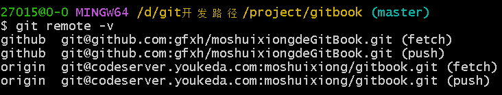

# 学习的第一性原理是自学
🐻 10/3 🐻

分析当前状态：
从 `git remote -v`可以看到你有两个远程仓库：



```
origin→ 优课达 (youkeda)

github→ GitHub
```
但 git push默认推到了 GitHub，这是因为你之前设置了上游分支。

解决方案：
方法一：分别推送（推荐，最安全）
```
# 推送到优课达
git push origin master

# 推送到 GitHub  
git push github master

# 或者用一行命令同时推送
git push origin master && git push github master
```
方法二：设置默认推送到两个仓库
```
# 删除当前的上游设置

git branch --unset-upstream

# 设置同时推送到两个远程仓库
git remote set-url --add --push origin git@codeserver.youkeda.com:moshuixiong/gitbook.git
git remote set-url --add --push origin git@github.com:gfxh/moshuixiongdeGitBook.git

# 现在 git push 会同时推送到两个仓库
git push

```
方法三：创建快捷命令
在 .bashrc或 .zshrc中添加别名：
```
# 添加到配置文件
alias push-all='git push origin master && git push github master'

# 然后就可以用这个命令同时推送
push-all
```
推荐方案：
​使用方法一
因为：

✅ 最清晰，不会搞混

✅ 可以控制推送到哪个平台

✅ 出现问题容易排查

​日常操作：​​
```
# 修改代码后...
git add .
git commit -m "描述"
git push origin master    # 只推送优课达
git push github master    # 只推送GitHub

# 或者
git push origin master && git push github master  # 同时推送
```
这样你就完全掌控推送目标了！🚀

